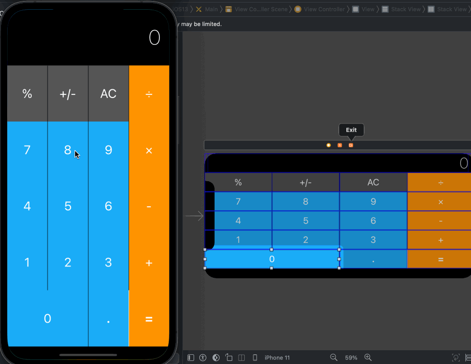

# Calculator Layout Boss Challenge

No knowledge is your own until you put it into practice. Using what I've learnt about auto layout, stack views and setting constraints, I will create the following UI. 

## Portrait

## Landscape

This is a difficult challenge. The goal is to create the vertical and horizontal stacks required for the layout of the calculator app.

